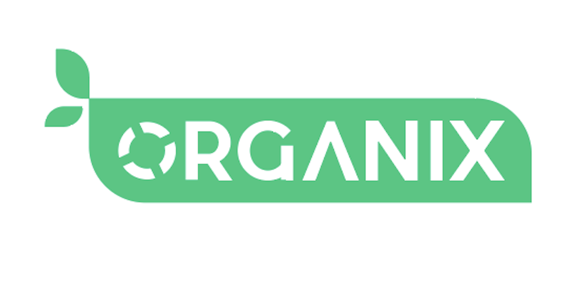
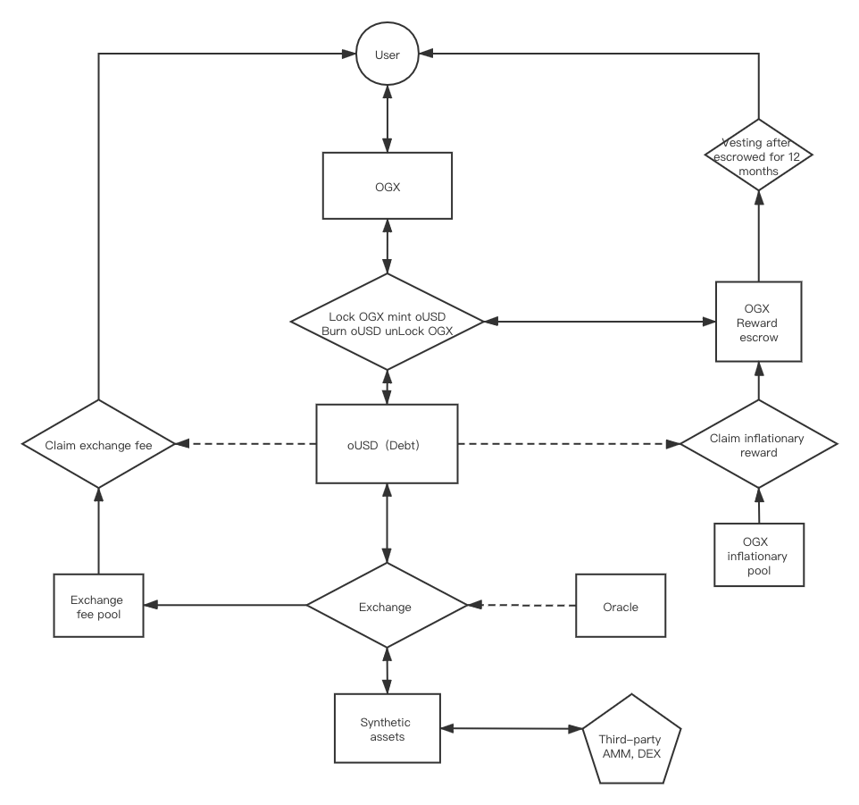
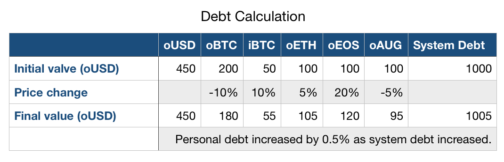
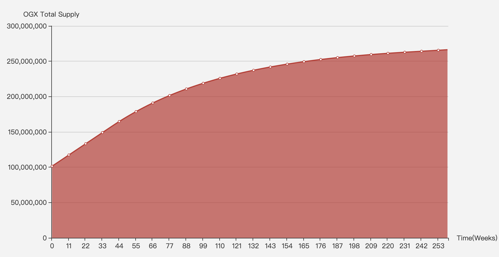

# Organix Whitepaper
#### Version 1.1 ( November, 2020 )

## Background
DeFi ( Decentralized Finance ) is one of the most suitable scenarios for blockchain ( decentralized, transparent, anonymous, trustworthy and value transmission, etc. )

In 2015, Ethereum brought Smart Contract into blockchain and with years of user accumulation and continuous contributions from the developers community, which led to plenty of projectes issued their token on the Ethereum Network. This is the main reason why DeFi can be developed on Ethereum. However, due to the performance bottleneck, high transaction fee and low TPS of Ethereum, DeFi is still unable to be widely popularized and applied[1]. The current mainstream DeFi projects on Ethereum have about 1,000 daily activities only[2]. 

EOS is the third generation blockchain system, which can achieve massive commercial adoptions with almost zero cost and second-onchain confirmation. Currently, games and DEXs built on EOS gain great successes and the user experience has been greatly imporved.

However, EOS projects in the DeFi area are still inactive. One of the main reasons that compared to Ethereum which has been running for many years, EOS mainnet is lack of asset varieties and liquidity. The essence of DeFi is mainly the stake, exchange and circulation among assets.

So the main key for DeFi on EOS to achieve successes is to solve the problems of varieties and liquidity of assets on EOS. And that's why we bring Organix. Meanwhile, the high performance of EOSIO is the basic for Organix to achieve nice user experience.

## Abstract
Organix is a decentralised synthetic asset issuance and trading protocol based on EOS

Synthetic asset is a financial tool used to simulate basic assets ( like Financial Derivatives ). Usually it requires excess collateral to mint synthetic assets, and the prices are synchronized from the real assets through an oracle.

MakerDAO is a synthethic assets protocol on Ethereum, and DAI which is staked and minted from the protocol is called the synthethic asset. Its price is pegged to the US Dollar, backed by multiple excess collateralized assets such as ETH, meanwhile, a certain staking rate and liquidation rate are used to ensure the stability of the DAI's price.

OGX is the basic token on Organix protocol, which can be used as collateral to mint OUSD. OUSD is the stable coin in the whole system, the system always values 1 OUSD at 1 USD backed by a 800% initial collateralisation ratio, to ensure the price of OUSD can absorb large price shocks of OGX. Synths can be exchanged with OUSD on the synthethic exchange of Organix system through prices supplied by oracles, included but not limited to fiat currencies, commodities, cryptocurrencies and their inverse assets.

Since the minting of synths doesn't need real assets or counterparties, it only requires enough supported value and stable oracle price feeding to mint a variety of and unlimited amount without consideration of problems of cross-chain assets and tokenized assets, which solves the problem of insufficient liquidity and homogeneous types of token of DEX currently.

## Main Functionality
### 1. Stake OGX, Mint or Burn OUSD
All OUSD are minted by excess collateralized OGX initially, initial collateralisation ratio ( C-Ratio ) is 800%. The number of OUSD a user can mint depends on the number of OGX he holds and locks, the user will incur debt when he mint OUSD, and to unlock the OGX he must pay back this debt. After the user mints synths, it will take 3 days before it can be burnt.

##### Example: 
Alice has 400 OGX, and the price of OGX is currently 2 USD, so Alice can mint 100 OUSD at most, she incurs the 100 OUSD debt in the system with 800% C-Ratio . If she mints only 50 OUSD, her debt will be 50 OUSD with 1600% C-Ratio.

Users' C-Ratio varies from price to price, they can increase the C-Ratio through staking more OGX or burning some OUSD. To be paid attentions, everyone's debt will vary according to the total amount of debt in the whole system and the debt ratio of all users. To unlock your staking OGX, you can take it back anytime after 3 days' staking when you pay back the debt (OUSD). For debt calculation, please refer to Debt Calculation.

### 2. Staking Rewards From Inflation And Exchange Fee
The weekly claimable OGX inflation rewards and exchange fees are allocated based in the proportion of debt each users has issued. In order to claim the rewards, the users' C-Ratio must be larger than minimal C-Ratio, which is 800% initially. Users can adjust their ratio by burning synths or stake more OGX when it falls below 800%. 

When the C-Ratio is lower than 200%, it can be marked as to be settled. There will be a buffer period. If the buffer period is exceeded, it can be liquidated by anyone. The liquidator can obtain more valuable OGX through paying OUSD.

### 3. Exchange Synths
Through Organix's synthetix assets exchange, various synthetic assets can be traded according to the price of the oracle conveniently. Cryptocurrencies like BTC, ETH and EOS, commodities, gold, crude oil, inverse cryptocurrencies like iBTC, iETH, iEOS and any other  assets that can be digitally simulated, without consideration of slippage and liquidity limitation, and charge an exchange fee which is 0.2%. And 0.18% fee is extracted and sent to the fee pool to reward OGX stakers, the other 0.02% will be sent to referral pool, or will be sent to the fee pool if there is no inviters.

##### Example :   
Alice holds 1000 OUSD, current price from oracle is 200 USD/ETH, so Alice can use her 1000 OUSD to buy 1000*0.998/200 = 4.99 OETH. And 1000 * 0.002 = 2 OUSD will be  extracted and sent to fee pool. If Alice is invited, so 1.8 OUSD will be sent to the fee pool and the other 0.2 OUSD will be sent to the inviter's personal revenue pool.

## Core Logic
### 1. Debt Calculation
The debt calculation is the most complicated part of the the Organix system, users will incur a debt when they stake OGX to mint OUSD, at this moment, the debt is the same as the minted OUSD amount. However, as the transactions and prices of synthetic assets continue to change in the system, the users' debt will increase or decrease, which is related to the total debt in the system.

If stakers pay back the debt, they can retrieve the staked OGX and will no longer be affected by system debt.

For an example, there are only two users in the system at the beginning, Alice and Bob. Both of them stake and mint 100 OUSD and incur a 100 OUSD debt. Total value of synthetic assets in the system is 200 OUSD, total debt is 200 OUSD too.

##### Case #1:   
Both Alice and Bob bought OBTC, when OBTC halves in price, the total value in the system halves, and the debt in the system would halve too, so each of the user's debt halves. Their debt changes from 100 OUSD to 50 OUSD, the synthetic assets value at 50 OUSD too. They can get back their staked OGX after pay back the debt. Although the price of OBTC drops, but none of them lose.

##### Case #2:   
If Alice bought OBTC and B still held the OUSD, when price of BTC halves,  total debt ( total value ) in the system changes to 50 + 100 = 150 OUSD, reduced by a quarter, so each one's debt reduced by a quarter. Alice and Bob both incur a 75 OUSD debt, but Alice's synthetic asset values at 50 OUSD at this moment, Bob still holds 100 OUSD. Alice needs to pay extra 25 OUSD to pay back the debt and get back the staked OGX, but Bob earns 25 OUSD without doing anything. Alice's OBTC halved, but she lost a quarter only.

##### Case #3:   
If Alice bought OBTC, Bob bought OETH, and then BTC was up 50% and ETH was up 10%, at this moment, the total debt ( total value ) in the system changes to 150 + 110 = 260 OUSD, which is up 30%, so both Alice and Bob's debt changes to 130 OUSD. And Alice's OBTC worths 150 OUSD, Bob's OETH worths 110 OUSD, so Alice earns 20 OUSD but Bob loses. At this scenario, although price of ETH went up, Bob still needs to pay extra 20 OUSD debt.

When there are fewer users and asset types, the total debt in the system will flutuate largely, but as the number of users and types of tradable assets increase, especially the inverse assets ( tracking the reverse trend of assets ), the total debt changes in the system will be more stable.

The following is an example of total debt changes caused by a price fluctuation：

There are two types of changes in debt pool and individual debt :  

1. The total debt in debt pool increases or decreases when holders mint or burn synths, the individual debt won't change, bu the proportion will.  
2. The total debt in debt pool increases or decreases when total value of synths change, the individual proportion won't change, but the debt will.

### 2. The Oracle

Limited by the consensus model of the blockchain, smart contracts can only call internal contract information, and cannot directly obtain information from systems outside the chain. The Blockchain Oracle is an implementation mechanism for the interaction between the blockchain and the external world. It establishes a trustworthy bridging mechanism between the blockchain and the external world, so that external data can enter the blockchain safely and reliably[3].

The oracle is the core module in the Organix protocol. The prices of all synthetic assets in the trading system are provided by multiple oracles. Use algorithms from multiple sources to form an aggregate value for each asset.

At the beginning of the project, Organix will use its own oracles and third-party oracles to provide the price feed of synthetic assets. The price information of synthetic assets will be weighted by combining multiple oracles on-chain and off-chain, multiple price sources and historical prices within a certain period to ensure the stability and to avoid early deal caused by  price fluctuations and untimely price updates.

### 3. The Inflation

To incent holders who engages into stake actively, the total supply will inflate from 100,000,000 to 245,000,000 in 3 years after the system launches, the inflation rate will decrease year by year. The inflated tokens are distributed to stakers weekly on a pro-rata proportion of debt each staker has issued. All the stakers who meet the minimum C-Ratio requirements of the system can claim the token, and tokens that are not claimed or allocated will be redistributed in next round.

The reason of the protocol's inflationary monetary policy is the debt, from stake OGX to mint OUSD, can fluctuate ( refer to Debt Calculation ). So the system designs inflation rewards and exchange fee rewards. With the gradual increase in transaction volume in the later period, the incentive effect of transaction fees will be more obvious. Just like BTC's incentives to miners, inflationary rewards will become less and less, and the proportion of miners' fees will gradually increase.

#### 3.1 OGX inflation rules

-  In the first 40 weeks, 1442307.6923 OGX was issued every week.
-  From the 40th week to the 234th week, the weekly inflation decreased by 1.25% each week.
-  After 234 weeks, the fixed inflation rate is 0.048077% (2.5% / 52) per week.

### 4. The Referral Mechanism

The referral mechanism on EOS is quite mature, many successful projects have confirmed that the incentive effect of this mechanism is positive. No matter decentralized wallets, portal like DApp store or other DeFi projects that are re-developed based on the protocol, even the individuals can benefit from promotions. The referral mechanism is carried out by adding a corresponding invitaion account for each transaction. 

Because there is no counterparty and can be traded unlimited,  and charge an exchange fee which is 0.2% each transaction, of which 10% of the fee or 0.02% will be sent to inviter's revenue pool. We encourage any projects, teams and individuals who recognize the protocol to integrate it or the DApp into their own services, and benefit from it.

### 5. Liquidity Incentive and Stake Incentive

In the early stage of the project, users can engage into trading of synthetic assets through staking OGX to mint OUSD only. In order to attract more users to participate in the trading of synths, we encourage everyone to provide liquidity for synthetic assets and other basic assets in third-party liquidity pools, not limited to swaps, loans and other DeFi protocols. In this way, even without OGX, users can exchange or borrow other assets to achieve various synthetic assets and experience the convenience brought by the trading of synthetic assets. 

At the same time, in order to maintain the stability of the debt pool, the staking incentives of some synthetic assets will be increased according to the total debt of the system. For example, most of the assets in the system are on OBTC. The rapid up or down of BTC may lead to the instability of the total debt of the system, then we can increase the staking incentives for the inverse asset IBTC, making the total debt of the system more stable. Tokens for both liquidity incentives and staking incentives are deducted from the inflationary OGX. In the early stage of the project, some incentive policy decisions may be made by a small number of people in the community. Later, decentralized governance and even automated adjustments will be introduced.

## Roles and Policies in the Ecosystem

### 1. Stakers
Stakers stake OGX to mint OUSD and incur a debt, and earn staking rewards which includes inflationary rewards and exchange fee rewards, but they also incur a risk of debt fluctuations of the system, the minted OUSD can be used to trade all synthetic assets actively. Users can also passively hold or provide liquidity on a third-party platform to earn additional incentives and market-making rewards from the corresponding platform. In short, your counterparty will be the other users in the entire system when you hold debt.

### 2. Debt-Free Traders
Debt calculation in the Organix is a complex system, but for debt-free traders, it is a perfect trading platform. You can get all kinds of synthetic assets through swaps or loans, and then trade on Organix Exchange with unlimited liquidity easily. The rise and fall of assets value ni longer need to be affected by total debt, but truly reflect the income situation, which is the same as the exchanges we usually use, and the value of these synthetic assets are backed by sufficient collaterals.

## Risks and Strategies
### 1. Current Risks
There are several risks in the system, as Organix is a complex system:

1. The main risk involves the debt OGX holders issue when they stake and mint synths. As previously explained on Debt Calculation, this debt can fluctuate due to the exchange rate shifts within the system. This neans that to exit the system and unlock their staked OGX, they may need to burn more Synths than they orginally minted.

2. Risks from price fluctuations in the OGX token. As the only collaterals in the early stage, all synthetic assets' price are backed by the collaterals. If price of OGX pummets by over 80% in a short period of time, the synthetic asset will lack sufficient value, and the value of the synthetic asset may be unpegged from the underlying asset value.

3. There are a number of aspects of the system that are currently centralised, examples of centralisation is the C-Ratio and distribution of rewards among other projects.

### 2. Risk Mitigation Strategies
1. Regarding the debt fluctuation, more diversified assets need to be added for adequate hedging. Through the connection between synthetic assets and basic assets, as the number of users grows and the existence of arbitrageurs will be gradually stable.

2. Regarding the OGX price fluctuation, as the project gradually be stable and doesn't depend on the inflationary rewards of OGX, other assets included but not limited to stable assets like EOS, USD(x), BTC, ETH will be gradually added to the system, which also increase the scale of the funds available in the system.

3. Regarding the governance, we will regularly discuss with various partners and community members to ensure that the project goals are consistent with the community, and gradually realize decentralized governance when the system become stable and mature.

## Roadmap

Mid-July, Project begining  

End of September, launch on testnet and start the test, code audit  

Early November, launch on mainnet. Implement main functions of the system: Stake OGX, Mint and Burn OUSD, Trading among synthetic assets, Claiming of inflationary rewards and trading rewards.  

December, liquidity rewards from third-party DeFi protocol and staking rewards from parts of synthetic assets.

#### In 2021,  

Season 1, integrate more Oracles includes but not limited to Chainlink, provide support for more types of synthetic assets including binary option.  

Season 2, add more collaterals includes but not limited to EOS, tokens in EOS ecosystem, stable coins on other DeFi projects, and cross-chain tokens like BTC and ETH, to increase the asset scale that the system can mint.  

Season 3, decentralized governance after the system is stable: adjustment of system's C-Ratio, liquidity incentive decisions, exchange fee, etc.  

Season 4, support unique debt pool for long and short of single token, to solve the trouble of the debt calculation from users.

#### In 2022,  

 It will be decided to start a new chain, based EOSIO or Polkadot, or not to support the synthetic exchenge according to the market size and EOS mainnet, where the OGX will be reflected as Coin.

### Token Distribution
Total supply : 100,000,000  

- Team - 25%  
Vesting four times on August 15, 2020, August 15, 2021, February 15, 2022 and August 15, 2022

- Foudation - 10%  

- Initial exchange - 39%  
Vesting four times on August 15, 2020, February 15, 2021, May 15, 2021 and August 15, 2021

- Public exchange - 20% ( 25% for TPT swap, and 75% for EOS swap )  

- Bounties & Marketing & Airdrop - 6%

Locked up tokens can be used to stake and mint synthetic assets and engage into debt calculation, claiming rewards. 

### Reference
[1] DeFi's Invisible Asymptotes [https://multicoin.capital/2020/06/04/defis-invisible-asymptotes/]  
[2] Defi in DappRadar [https://dappradar.com/rankings/category/defi]  
[3] Decentralised Oracles: a comprehensive overview [https://medium.com/fabric-ventures/decentralised-oracles-a-comprehensive-overview-d3168b9a8841]

### Disclaimer
This Whitepaper is for information conveying only. It does not constitute an investment. Recommendations or suggestions or incentives for buying or selling any investment should not be used to evaluate the merits of any investment decision. It should not be used as a basis for accounting, legal or tax advice or investment advice. This Whitepaper only represents the current perspectives of the author, and the perspectives reflected in this article are subject to change without notice.
